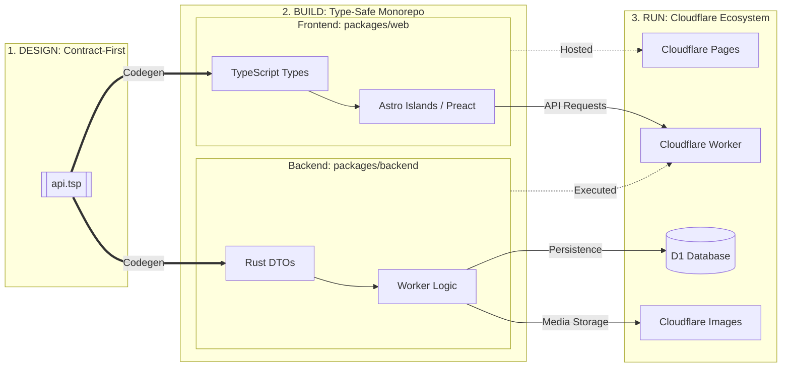

# Event Venue Booking Platform

A full-stack event venue search and booking platform built with Rust, Astro, and Cloudflare.

## Project Structure

This project is a monorepo organized into two main packages:

- **`packages/backend`**: A Cloudflare Worker built with Rust and the `worker` crate.
- **`packages/web`**: An Astro frontend using Preact and Tailwind CSS, hosted on Cloudflare Pages.

## Shared API Contract

We use [TypeSpec](https://typespec.io/) as the single source of truth for our API definitions.

1.  **Contract (`api.tsp`)**: Defined at the root.
2.  **Rust DTOs**: Generated in `packages/backend/src/models/dtos.rs`.
3.  **Frontend Types**: Generated in `packages/web/src/types/api.d.ts`.

To update all generated code after changing `api.tsp`, run:
```bash
mise run codegen
```

## Architecture Visualization



## Features

- **Rust Backend**: High-performance serverless logic on Cloudflare Workers.
- **Astro Frontend**: Optimized "Islands" architecture for fast page loads.
- **D1 Database**: Cloudflare's serverless SQL database.
- **Cloudflare Images**: Integrated image storage and resizing.
- **Shared Type Safety**: End-to-end type safety from the API contract to the React (Preact) components.

## Prerequisites

- [mise](https://mise.jdx.dev/) for tool version management.
- [Cloudflare Wrangler](https://developers.cloudflare.com/workers/wrangler/install-and-update/) for local development and deployment.

## Getting Started

### 1. Environment Configuration

1.  **Local Environment**: Copy the example file and fill in your values:
    ```bash
    cp .env.example .env
    ```
2.  **Database Setup**: Initialize your local D1 database:
    ```bash
    mise run db:migrate:local
    ```

### 2. Development

Start both the backend and frontend dev servers concurrently:
```bash
mise run dev
```

- **Backend**: `http://localhost:8787`
- **Frontend**: `http://localhost:4321`

### 3. Testing

Run backend unit and E2E tests:
```bash
mise run test
```

## Deployment

The project is designed for Cloudflare:

- **Backend**: Deployed as a Worker.
- **Frontend**: Deployed to Cloudflare Pages.

To deploy everything:
```bash
mise run deploy
```

## License

Proprietary. Copyright (c) 2026 Rick Foxcroft. All rights reserved. See `LICENSE` for more details.
