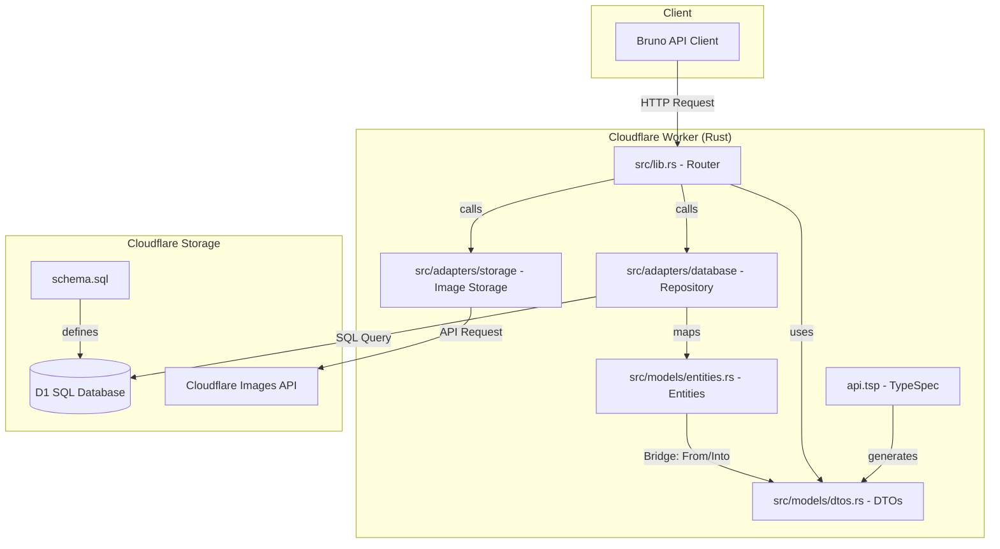

# Event Venue Backend

Backend for an event venue search and booking platform, built with Rust and Cloudflare Workers.

## Workflow: Contract-First & Database-First

This project uses a "Bridge" pattern to separate API contracts from database storage:

1. **Contract (`api.tsp`)**: Defined using [TypeSpec](https://typespec.io/). This generates the `RustDTOs`.
2. **Storage (`schema.sql`)**: Defined using SQL for Cloudflare D1. This generates the `RustEntities`.
3. **The Bridge**: In `src/models/dtos.rs`, we implement `impl From<Entity> for DTO` to map database models to API responses.

## Features

- **Cloudflare Workers**: Serverless backend.
- **Rust**: High performance and safety.
- **D1 Database**: Cloudflare's serverless SQL database.
- **Cloudflare Images**: Optimized image storage and delivery with built-in resizing.
- **TypeSpec**: API contract definition.

## Architecture Visualization



## Prerequisites

- **Option A: Dev Container (Recommended)**: [Docker Desktop](https://www.docker.com/products/docker-desktop/) or [OrbStack](https://orbstack.dev/) and VS Code with the [Dev Containers extension](https://marketplace.visualstudio.com/items?itemName=ms-vscode-remote.remote-containers).
- **Option B: Manual Setup**: [mise](https://mise.jdx.dev/) for tool version management.

## Getting Started

### 1. Environment Configuration

This project uses `.env` files for local configuration and GitHub Secrets for CI/CD.

1.  **Local Environment**: Copy the example file and fill in your values:

    ```bash
    cp .env.example .env
    ```

    - `PROD_BASE_URL`: The URL of your deployed Cloudflare Worker (used by Bruno).

2.  **Cloudflare Configuration**: Update `wrangler.toml` with your specific D1 Database IDs:
    - The top-level `[[d1_databases]]` is for local development.
    - The `[env.production]` block is for your deployed database.

### 2. API Testing (Bruno)

We use [Bruno](https://www.usebruno.com/) for API testing, with request definitions stored in the `bruno/` directory.

1.  Open the Bruno app.
2.  Click **Open Collection** and select the `bruno/` folder in this project.
3.  Select an environment (**Local** or **Production**) from the top-right dropdown.
4.  If using **Production**, ensure your `.env` file has the correct `PROD_BASE_URL`.

## Local Development

### Using Dev Containers (VS Code/Cursor)

1.  Open the project in VS Code.
2.  Click **"Reopen in Container"** when prompted (or run `Dev Containers: Reopen in Container` from the Command Palette).
3.  All tools and dependencies will be automatically installed.

### Manual Setup (CLI)

1.  **Install system dependencies** (Linux-specific, e.g., Ubuntu):

    ```bash
    sudo apt-get install -y libssl-dev pkg-config
    ```

2.  **Install tools and dependencies**:

    ```bash
    mise install
    ```

3.  **Generate code and API specs**:

    ```bash
    mise run codegen
    ```

    This command generates both the Rust DTOs and the OpenAPI/Swagger specification.

4.  **Run tests**:

    ```bash
    mise run test
    ```

5.  **Run the Worker locally**:
    ```bash
    mise run dev
    ```

## API Documentation (Swagger/OpenAPI)

This project uses **TypeSpec** as the source of truth for the API contract.

### Generating the Specification

The OpenAPI 3.0 specification is automatically generated whenever you run the `codegen` task:

```bash
mise run codegen
```

### Artifacts

- **Location**: `tsp-output/openapi.yaml`
- **Format**: OpenAPI 3.0 (YAML)

You can visualize this file by pasting its content into the [Swagger Editor](https://editor.swagger.io/) or by using a local Swagger UI viewer.

## Database Migrations (D1)

To manage your database schema and migrations:

1. **Apply Migrations Locally**:

   ```bash
   mise run db:migrate:local
   ```

2. **Apply Migrations to Production**:

   ```bash
   mise run db:migrate:remote
   ```

> **Note on `wrangler types`**: While `npx wrangler types` is great for generating TypeScript definitions from your bindings, in this Rust project, we manually define our `Entities` in `src/models/entities.rs` to match the D1 schema, ensuring full control over Rust's type system and serialization.

## Project Structure

- `api.tsp`: API contract (TypeSpec).
- `schema.sql`: Initial database schema.
- `src/models/entities.rs`: Database models (Entities).
- `src/models/dtos.rs`: API Data Transfer Objects (DTOs) and conversion logic.
- `src/lib.rs`: Worker entry point and routing.

## License

Proprietary. Copyright (c) 2026 Rick Foxcroft. All rights reserved. See `LICENSE` for more details.
